# Programme Reporting — Starter Semantic Model

**Source:** `jira.*` (28 tables) + `xray.*` (2 tables), Fabric medallion Gold layer
**Target:** Power BI star schema (`Gold.gold` prefix)
**Status:** Draft for review

---

## 1. The one idea that keeps this simple

In this Jira instance **almost everything is an Issue**. Requirements, user stories, bugs, risks, issues, decisions, actions, policies, test sets and tests are all rows in `jira.issues` — they only differ by issue type and by which custom fields are populated.

That means we do **not** need a separate model per dashboard. We need:

- **one issue dimension** (`Dim_Issue`) that everything hangs off,
- **one issue fact** (`Fact_Issue`) for current state,
- **a small number of event facts** for things that happen *over time* (status changes, worklogs, test runs, daily snapshots),
- **bridges** for the genuine many-to-many relationships (labels, versions, sprints, people, links).

Everything the client asked for — plus most of what they'll ask for next — falls out of that. The distinguishing attribute is `Issue_Category` on `Dim_Issue`:

| Issue_Category | Jira issue types | Feeds dashboards |
|---|---|---|
| Delivery | Epic, Story, Task, Sub-task | 1, 2, 3, 8 |
| Defect | Bug | 8, 10, 11 |
| Requirement | Requirement, Functional Requirement, User Story | 4, 11 |
| RAID | Risk, Issue, Assumption, Dependency | 1, 5 |
| Governance | Decision, Action, Key Design Decision | 14 |
| Policy | Policy | 6 |
| Change | Business Change, Comms, Training | 7 |
| Test | Test Set, Test, Test Execution, Test Plan | 10, 11 |
| Programme | Programme, Initiative | 1, 12 |

`Issue_Category` is a config-driven lookup (see §7), **not** hardcoded logic. Adding a new issue type means adding a row, not editing a model.

---

## 2. Model at a glance

```mermaid
erDiagram
    Dim_Date       ||--o{ Fact_Issue : "8 role-playing roles"
    Dim_Issue      ||--|| Fact_Issue : ""
    Dim_Project    ||--o{ Fact_Issue : ""
    Dim_IssueType  ||--o{ Fact_Issue : ""
    Dim_Status     ||--o{ Fact_Issue : ""
    Dim_Priority   ||--o{ Fact_Issue : ""
    Dim_User       ||--o{ Fact_Issue : "Assignee / Reporter / Creator"
    Dim_Team       ||--o{ Fact_Issue : ""
    Dim_Workstream ||--o{ Fact_Issue : ""

    Dim_Issue ||--o{ Fact_IssueDaily : ""
    Dim_Issue ||--o{ Fact_IssueTransition : ""
    Dim_Issue ||--o{ Fact_Worklog : ""
    Dim_Issue ||--o{ Fact_TestRun : "Test"
    Dim_Issue ||--o{ Fact_ResourceAllocation : ""

    Dim_Issue ||--o{ Bridge_IssueSprint : ""
    Dim_Issue ||--o{ Bridge_IssueVersion : ""
    Dim_Issue ||--o{ Bridge_IssueLabel : ""
    Dim_Issue ||--o{ Bridge_IssueComponent : ""
    Dim_Issue ||--o{ Bridge_IssueLink : ""

    Dim_Sprint     ||--o{ Bridge_IssueSprint : ""
    Dim_Version    ||--o{ Bridge_IssueVersion : ""
    Dim_Component  ||--o{ Bridge_IssueComponent : ""
    Dim_LinkType   ||--o{ Bridge_IssueLink : ""
    Dim_Board      ||--o{ Dim_Sprint : ""
    Dim_TestStatus ||--o{ Fact_TestRun : ""
    Dim_User       ||--o{ Fact_Worklog : ""
    Dim_User       ||--o{ Fact_ResourceAllocation : ""
```



**Layer 1 (core star)** — what the client sees and understands first: `Dim_Issue`, `Fact_Issue`, `Dim_Date`, `Dim_Project`, `Dim_Status`, `Dim_IssueType`, `Dim_Priority`, `Dim_User`, `Dim_Workstream`, `Dim_Team`.

**Layer 2 (depth)** — event facts and bridges, hidden behind display folders until needed.

**Layer 3 (external feeds)** — budget, capacity, benefits, training. Stubbed now so they slot in without redesign (§8).

---

## 3. Dimensions

### `Dim_Issue` — the spine
**Grain:** one row per Jira issue. **Source:** `jira.issues`, `jira.issue_subtasks`.

This is both the drill-down dimension *and* the Gantt hierarchy. Keep descriptive attributes here; keep numbers in `Fact_Issue`.

| Column | Source | Notes |
|---|---|---|
| `Issue_SK` | surrogate | |
| `Issue_ID`, `Issue_Key` | `id`, `key` | `Issue_Key` is the natural key users recognise |
| `Summary` | `fields_summary` | |
| `Issue_Category` | config lookup on issue type | §1 |
| `Parent_Key`, `Parent_Issue_SK` | `fields_parent_key` | self-referencing |
| `Epic_Key`, `Epic_Name` | `fields_epic_link`, `fields_epic_name` | |
| `Hierarchy_Level_1..6` | derived (typed placement) | Programme → Initiative → Epic → Story → Sub-task |
| `Hierarchy_Depth` | derived | |
| `Sort_Path` | derived from `fields_rank` (LexoRank) | preserves Jira backlog order in the Gantt |
| `Is_Leaf`, `Is_Parent`, `Is_Subtask` | derived | |
| `Workstream` | `fields_workstream` | |
| `Work_Package` | `fields_work_package` | |
| `Release` | `fields_release` | free-text; reconcile against `Dim_Version` |
| `MoSCoW` | `fields_moscow_value` | |
| `Is_Flagged` | `fields_flagged` | impediment marker |
| `Delivery_Team` | `fields_delivery_team_s` | |
| `Acceptance_Criteria`, `Description` | long text | keep, but mark as non-summarisable |
| `Risk_Or_Issue_Type` | `fields_risk_or_issue_type_value` | splits Risk vs Issue within RAID |
| `Complexity`, `Category`, `Source`, `Supplier` | matching `_value` fields | |
| `Primary_Fix_Version`, `Primary_Component`, `Primary_Label` | first value from bridge | **simple path** — single-select filters for casual users |
| `Issue_URL` | derived | deep-link back to Jira from any visual |

> **Design note:** the `Primary_*` columns are deliberate redundancy. 90% of client filtering is single-value; the bridges (§5) stay available for the 10% that needs full many-to-many.

### `Dim_Date`
Standard calendar, plus `Is_Working_Day`, `Fiscal_Quarter`, `Sprint_Week`, `Is_Current_Period`. One physical table, used as a **role-playing dimension** with inactive relationships for: Created, Due, Planned Start, Target End, Actual Start, Actual End, Resolution, Snapshot. Expose via `USERELATIONSHIP` measures rather than duplicate tables.

### `Dim_Status`
**Source:** `jira.statuses` + config. Adds:
- `Status_Category` (`new` / `indeterminate` / `done` — from `statusCategory_key`)
- `Status_Group` (Not Started / In Progress / Blocked / In Review / Done / Cancelled) — **config-driven**
- `Flow_State` (Queue / Active / Wait / Done) — drives flow-efficiency maths
- `Is_Done`, `Is_Blocked`, `Sort_Order`

Statuses are project-scoped in Jira (`scope_project_id`), so several rows share a name. Deduplicate to a canonical status list and keep the project-scoped IDs in a mapping table, or the client will see "To Do" three times in a slicer.

### `Dim_IssueType`
**Source:** `jira.issuetypes`, `jira.project_issue_types`. Carries `Hierarchy_Level` (Programme 5 → Initiative 3 → Epic 1 → Story/Task/Bug/Risk 0 → Sub-task −1), `Is_Subtask`, and the `Issue_Category` mapping.

### `Dim_User`
**Source:** `jira.users`. Role-playing: Assignee, Reporter, Creator, Executor, Worklog Author, Person Involved. Add `Is_Active`, `Is_Contractor` (config), `Primary_Workstream` (config), `Cost_Rate` (external, optional).

Handle the many-to-many via `Fact_ResourceAllocation` (§4) rather than six copies of the dimension. Keep **one** physical `Dim_User`; use inactive relationships + measures.

### `Dim_Project`, `Dim_Board`, `Dim_Sprint`
Straight from `jira.projects`, `jira.boards`, `jira.sprints`. `Dim_Sprint` gains `Sprint_Number`, `Duration_Days`, `Is_Current`, `Days_Remaining`, `Board_Name`, and `Sprint_State` (future/active/closed). Sprints belong to boards, boards to projects — a clean drill path.

### `Dim_Version`
**Source:** distinct versions from `jira.issue_fix_version` + `jira.issue_affects_version`. This becomes the **Release / Tranche** dimension: `Version_Name`, `Release_Name`, `Tranche`, `Planned_Release_Date`, `Actual_Release_Date`, `Release_Status`. Parse or configure `Tranche` — this is what dashboard 1 pivots on.

### `Dim_Workstream`
Small config dimension (9 rows): `Workstream_Name`, `Workstream_Lead`, `Display_Order`, `Is_Reported`. Small, but it means the balanced scorecard shows all nine workstreams even when one has no data — which is itself the signal leadership needs.

### `Dim_Team`
From `fields_team_*`. Distinct from Workstream and from Board — a team can serve several workstreams.

### `Dim_Component`, `Dim_LinkType`, `Dim_Priority`, `Dim_Resolution`, `Dim_TestStatus`
Direct lifts from `jira.issue_components`, `jira.issue_link_types`, `jira.priorities`, `jira.resolutions`, `xray.statuses`. `Dim_TestStatus` gains `Is_Final`, `Coverage_Status` (OK / NOK / NOTRUN) and the colour, matching the Xray configuration screen.

---

## 4. Facts

### `Fact_Issue` — current state
**Grain:** one row per issue. **Type:** accumulating snapshot.

FKs: Issue, Project, IssueType, Status, Priority, Resolution, Assignee, Reporter, Creator, Team, Workstream, + 8 date roles.

| Measure group | Columns |
|---|---|
| Count | `Issue_Count` (=1) |
| Effort | `Story_Points`, `Story_Point_Estimate`, `Original_Estimate_Secs`, `Remaining_Estimate_Secs`, `Time_Spent_Secs`, `Aggregate_*` equivalents |
| Progress | `Progress_Percent`, `Aggregate_Progress_Percent`, `Work_Ratio` |
| Cost | `ROM_Cost`, `Refined_Cost`, `Original_Cost`, `Current_Cost`, `Actual_Cost` |
| Risk | `Likelihood_Score`, `Severity_Score`, `Cost_Impact_Score`, `Time_Impact_Score`, `Scope_Impact_Score`, `Benefits_Impact_Score`, `Risk_Total_Score`, `Risk_Previous_Score`, `Residual_*` equivalents |
| Test rollup | `Total_Tests`, `Passed_Tests` (from `fields_total_tests` / `fields_passed_tests`) |
| Derived durations | `Age_Days`, `Cycle_Time_Days`, `Lead_Time_Days`, `Days_Overdue`, `Schedule_Variance_Days`, `Days_Since_Update` |
| Flags | `Is_Open`, `Is_Done`, `Is_Overdue`, `Is_Blocked`, `Has_Parent`, `Has_Linked_Test`, `Has_Linked_Requirement` |
| Gantt dates | `Plan_Start`, `Plan_End`, `Actual_Start`, `Actual_End` + rolled-up parent equivalents |

`Risk_Total_Score` vs `Risk_Previous_Score` gives risk *movement* free of charge — direction of travel is usually more useful to a Programme Board than the absolute score.

### `Fact_IssueDaily` — the future-proofing table
**Grain:** one row per issue per day (or per issue per day *while open*, to control volume).

This single table is what stops the model needing a redesign in six months. It gives:

- scope burndown **and** burnup at any level (release, workstream, sprint, epic)
- scope-change detection — issues added to / removed from a release after commitment
- ageing WIP over time, not just today
- risk exposure burndown
- "as at end of last month" comparisons and period-over-period trend for every metric
- backlog growth vs completion rate

Columns: `Snapshot_Date`, `Issue_SK`, `Status_SK`, `Sprint_SK`, `Assignee_SK`, `Story_Points`, `Remaining_Estimate_Secs`, `Risk_Total_Score`, `Is_Open`, `Is_Blocked`, `Days_In_Current_Status`, `In_Scope_Flag`.

Build it forward from today (append daily) *and* backfill from `jira.histories` / `jira.history_items` where field-level history allows. Partition by `Snapshot_Date`.

> Volume check: ~60k issues × 365 days ≈ 22m rows/year. Restrict to open issues + a month-end row for closed ones and it drops by an order of magnitude.

### `Fact_IssueTransition` — flow and cycle time
**Grain:** one row per field change. **Source:** `jira.histories` + `jira.history_items`.

Filter to `field_name IN ('status','assignee','Sprint','Flagged','priority','Fix Version')` for the reporting layer; keep the rest in Silver.

Columns: `Transition_ID`, `Issue_SK`, `Changed_Date_SK`, `Author_SK`, `Field_Name`, `From_Status_SK`, `To_Status_SK`, `Duration_In_From_State_Secs`, `Is_Forward`, `Is_Reopen`, `Is_Blocked_Entry`.

Unlocks: time in status, flow efficiency (Active ÷ Total), reopen rate, blocked duration, first-response time, assignee churn, sprint spillover count. None of these are answerable from current state alone.

### `Fact_Worklog`
**Grain:** one row per worklog entry. **Source:** `jira.worklogs`.
`Worklog_ID`, `Issue_SK`, `Author_SK`, `Started_Date_SK`, `Time_Spent_Secs`, `Time_Spent_Hours`.
Feeds actual effort, utilisation, cost-of-delivery and contractor spend.

### `Fact_ResourceAllocation`
**Grain:** one row per issue per person per role.
**Source:** union of `fields_assignee_*` (role = Assignee) and `jira.issue_people_involved` (role = Involved), plus reporter/creator if wanted.

`Issue_SK`, `User_SK`, `Role`, `Allocation_Weight`, `Sprint_SK`, `Workstream_SK`, `Story_Points`, `Remaining_Estimate_Secs`.

This is the table that answers "who is over-allocated" — the assignee alone understates load badly on a programme where people are named on work they don't own. `Allocation_Weight` (default 1 for Assignee, fractional for Involved) prevents double-counting effort when summing across roles.

### `Fact_TestRun`
**Grain:** one row per Xray test run (test × execution). **Source:** `xray.test_runs`.

`Run_ID`, `Test_Issue_SK`, `Execution_Issue_SK`, `Test_Status_SK`, `Executed_By_SK`, `Started_Date_SK`, `Finished_Date_SK`, `Duration_Mins`, `Test_Type`, `Is_Pass`, `Is_Fail`, `Is_Blocked`, `Is_Latest_Run`.

`Is_Latest_Run` matters: current pass rate must use the latest run per test, while trend analysis uses all runs. Flag it once in Gold rather than solving it repeatedly in DAX.

---

## 5. Bridges (many-to-many)

| Bridge | Grain | Source | Why it can't be an attribute |
|---|---|---|---|
| `Bridge_IssueSprint` | issue × sprint | `jira.issue_sprints` | Issues carry across sprints — this *is* the spillover measure |
| `Bridge_IssueVersion` | issue × version × role | `issue_fix_version`, `issue_affects_version` | `Role` = Fix / Affects; an issue can span releases |
| `Bridge_IssueLabel` | issue × label | `jira.issue_labels` | Labels are the client's ad-hoc taxonomy (blocker themes, etc.) |
| `Bridge_IssueComponent` | issue × component | `jira.issue_components` | System-area clustering for dashboard 5 |
| `Bridge_IssueLink` | issue × linked issue × link type | `jira.issue_links` | The traceability backbone |

### `Bridge_IssueLink` deserves a note

It's how the model answers dashboard 4 and 11 without new structures. `jira.issue_link_types` includes `tests` / `is tested by`, `blocks` / `is blocked by`, `implements` / `is implemented by`, `Integration Source` / `Integration Target`, `Info Gov`, `Finance`, plus `created by` / `Defect`.

Store **both directions** (one row per direction, with `Direction = Inward|Outward`) so a user can start from either end without writing bidirectional DAX. Then:

- **Traceability heatmap:** Requirement → Story (`implements`) → Test Set (`is tested by`) → Test → Defect (`created by`)
- **Orphan detection:** requirements with no outward `implements` link; stories with no inward requirement link (scope creep); requirements with no `is tested by` link (coverage gap)
- **Cross-workstream blockers:** `blocks` links where the two issues have different `Workstream` values — an easy, high-value visual the client hasn't asked for yet
- **Dependency network:** feeds a dependency matrix or network visual

Pair it with a **role-playing copy of `Dim_Issue`** (`Dim_LinkedIssue`) so both ends can be sliced independently.

---

## 6. The testing hierarchy

The client wants: **Issue → Test Set → Tests**. Structurally that's:

```
Story / Requirement  (Dim_Issue, Issue_Category = Requirement)
   └── is tested by ──►  Test Set   (Dim_Issue, Issue_Category = Test)
                            └── contains ──►  Test   (Dim_Issue, Issue_Category = Test)
                                                 └── Fact_TestRun (per execution)
                                                        └── Test Execution (Dim_Issue)
```

Because Test Sets and Tests are both Jira issues, they live in `Dim_Issue` and inherit the whole hierarchy machinery — no separate testing model. Add a `Test_Level` column (Test Plan / Test Set / Test / Test Execution) and a `Test_Set_Key` on `Dim_Issue` for tests, so the client gets a clean two-level expand in a matrix visual.

**⚠ Gap:** the extract gives `xray.test_runs` (test ↔ execution) but **not** Test Set ↔ Test membership. Right now the Test Set → Test relationship can only be inferred from `jira.issue_links` or `fields_parent_key`, which may not be populated for Xray objects. We need one of:

1. an `xray.test_sets` / `xray.test_set_tests` extract, or
2. confirmation that Xray writes Test Set membership to a Jira link type or parent field.

Without it the requested hierarchy can be built one level short. Worth resolving before build starts — it's a small ingestion change now and an expensive one later.

Also missing but likely wanted soon: **test steps** (for step-level failure analysis) and **test environments** (for dashboard 10's environment availability).

---

## 7. Config tables — where the flexibility actually lives

Four small, client-editable tables. This is the difference between "new requirement = new DAX" and "new requirement = new row".

### `Config_IssueCategory`
`Issue_Type_Name` → `Issue_Category`, `Report_Group`, `Display_Order`. New issue type in Jira? Add a row.

### `Config_StatusMapping`
`Status_Name` (+ optional `Project_Key`) → `Status_Group`, `Flow_State`, `Is_Blocked`, `Sort_Order`. Handles the project-scoped status duplication and lets the client re-band statuses without a model change.

### `Config_Metric` — the workstream scorecard engine
The brief already shows that "% Work Complete" means something different per workstream:

> Release 1 Development = % of total user stories developed and tested
> Info Gov = % DSAs done, % DPIAs done
> Business Change = % service training delivered

Rather than nine bespoke measures, one config table:

| Column | Example |
|---|---|
| `Metric_Name` | % Work Complete |
| `Workstream` | Information Governance |
| `Numerator_Filter` | `Issue_Category = 'Delivery' AND Label = 'DPIA' AND Is_Done` |
| `Denominator_Filter` | `Issue_Category = 'Delivery' AND Label = 'DPIA'` |
| `Target_Value` | 0.85 |
| `RAG_Green_Threshold` / `RAG_Amber_Threshold` | 0.90 / 0.70 |
| `Display_Order`, `Is_Active` | |

A single generic DAX measure resolves against this table. Adding a workstream metric becomes a data edit — which is exactly what makes the balanced scorecard (dashboard 2) survive contact with a live programme.

### `Config_ReleaseTranche`
`Version_Name` → `Release_Name`, `Tranche`, `Planned_Date`, `Sequence`. The `fields_release` free-text field will not stay clean; a mapping table absorbs the mess.

---

## 8. What Jira can't give you (external feed stubs)

Several requested dashboards need data that simply isn't in this extract. Stub the tables now with the right grain and conformed keys, and they plug in later with no remodelling.

| Table | Grain | For | Likely source |
|---|---|---|---|
| `Fact_Budget` | workstream × period × scenario (Budget/Forecast/Actual) | Dashboard 1 — budget vs forecast vs actuals | Richard's Power BI forecast model |
| `Fact_Capacity` | person × sprint (or week) | Dashboards 2, 13 — utilisation, over-allocation | Manual / Tempo / resource plan |
| `Fact_Benefit` | benefit × period × measure type (Baseline/Target/Actual) | Dashboard 12 | Benefits register |
| `Fact_Training` | person × course × status | Dashboard 7 | Business Change / LMS |
| `Fact_ReadinessAssessment` | department × assessment date × criterion | Dashboards 7, 11 | Business Change |
| `Dim_Policy` / policy lifecycle | policy × status | Dashboard 6 | Confluence, if policies aren't Jira issues |
| `Fact_ConfluenceActivity` | page × date | Dashboards 6, 14 | Confluence API |

**Utilisation is impossible without `Fact_Capacity`.** `Fact_Worklog` gives hours *spent*; utilisation is spent ÷ available, and Jira holds no availability. Flag this early — it's the most common source of "why is this dashboard blank".

Also note: **`Fact_Worklog` only works if teams actually log time.** Worth sampling coverage by workstream before promising dashboard 13.

---

## 9. Dashboard → model mapping

| # | Dashboard | Tables used | Ready now? |
|---|---|---|---|
| — | **Timeline / Gantt** | `Dim_Issue` (Sort_Path, hierarchy, rolled-up dates) + `Fact_Issue` | ✅ |
| — | **Resource planning** | `Fact_ResourceAllocation`, `Fact_Worklog`, `Dim_User`, `Dim_Sprint` | ⚠ needs `Fact_Capacity` |
| — | **Testing hierarchy** | `Dim_Issue` (Test_Level), `Fact_TestRun`, `Bridge_IssueLink` | ⚠ needs Test Set membership |
| 1 | Tranche / release overview | `Dim_Version`, `Fact_IssueDaily`, `Bridge_IssueLink`, `Fact_Issue` | ⚠ budget external |
| 2 | Workstream health scorecard | `Config_Metric`, `Fact_Issue`, `Dim_Workstream` | ⚠ capacity external |
| 3 | Delivery execution (sprint/kanban) | `Fact_IssueDaily`, `Fact_IssueTransition`, `Bridge_IssueSprint` | ✅ |
| 4 | Requirements lifecycle | `Bridge_IssueLink`, `Fact_IssueTransition`, `Dim_Status` | ✅ |
| 5 | Risk & issue intelligence | `Fact_Issue` (risk scores), `Fact_IssueDaily`, `Bridge_IssueLabel`, `Bridge_IssueComponent` | ✅ |
| 6 | Policy readiness | `Dim_Issue` (Policy category), `Fact_IssueTransition` | ⚠ if policies live in Confluence |
| 7 | Business change adoption | — | ❌ external |
| 8 | Development quality | `Fact_Issue` (Defect), `Fact_IssueTransition` (reopens), `Bridge_IssueLink` | ✅ |
| 9 | Data migration & quality | `Dim_Issue` (Data workstream), `Fact_TestRun` | ✅ partial |
| 10 | End-to-end testing | `Fact_TestRun`, `Bridge_IssueLink`, `Dim_TestStatus` | ⚠ environments missing |
| 11 | Release readiness | `Bridge_IssueLink` traceability + `Fact_TestRun` + `Fact_Issue` | ✅ core |
| 12 | Benefits realisation | — | ❌ external |
| 13 | Resource & capacity | `Fact_Worklog`, `Fact_ResourceAllocation` | ⚠ capacity + rates external |
| 14 | Decision & action management | `Dim_Issue` (Governance category), `Fact_Issue` (ageing) | ✅ |

---

## 10. Measures worth building beyond the brief

The client asked for status. These answer *why*, and they need no new tables.

**Flow & performance**
- Flow efficiency = Active time ÷ Total elapsed (`Fact_IssueTransition` + `Flow_State`)
- Cycle-time 50th/85th percentile — far more honest than an average for forecasting
- Throughput per week and a Monte Carlo "when will this release finish" from historic throughput
- Ageing WIP by status — the single best early warning of a stalled workstream
- Say/do ratio: sprint committed vs delivered (`Fact_IssueDaily` at sprint start vs end)

**Quality**
- Defect escape rate by phase (system test → UAT → prod), via `Bridge_IssueLink` `created by`
- Reopen rate and rework ratio (`Is_Reopen`)
- First-time pass rate vs eventual pass rate (`Fact_TestRun`, all runs vs latest)
- Defect density per requirement / per component

**Risk & governance**
- Risk exposure trend and risk burndown (`Fact_IssueDaily` × `Risk_Total_Score`)
- Gross vs residual score — mitigation effectiveness, which the residual fields already support
- Ageing decisions and actions with no movement in 14/30 days
- Blocked-days accumulated per workstream

**Traceability & coverage**
- Requirements with no test coverage — the number the Programme Board will care about most at go-live
- Stories with no parent requirement (scope creep)
- Cross-workstream dependency count and average dependency resolution time

**Comparison & drill-down**
- Period-over-period on any measure via `Fact_IssueDaily` + `Dim_Date`
- Team-vs-team velocity normalised per FTE (Dev vs DGP Dev)
- Release-over-release comparison of quality and schedule variance

---

## 11. Conventions

- **Names:** `Dim_`, `Fact_`, `Bridge_`, `Config_`. Business-friendly column names in the semantic model (`Story Points`, not `fields_story_points`) — the rename happens once, in Gold.
- **Keys:** integer surrogate keys on every dimension; natural keys retained and visible (`Issue_Key` is what the client speaks in).
- **Relationships:** single-direction, one-to-many, from dimension to fact. Bi-directional filtering only on bridges, and only where measured to be necessary.
- **Measures:** all in a dedicated `_Measures` table, organised in display folders that mirror the dashboard groupings.
- **Hidden:** every key column, every `_SK`, every bridge. The client should see roughly 10 tables, not 30.
- **Date handling:** one `Dim_Date`, marked as a date table, inactive relationships + `USERELATIONSHIP`.
- **Row-level security:** add `Workstream` as an RLS dimension from day one, even if unused — retrofitting it is painful.

---

## 12. Open questions for the client

1. **Test Set → Test membership** — can Xray expose this (§6)? Blocks the requested testing hierarchy.
2. **Release / tranche definition** — is `fields_release`, fix version, or a label the source of truth? They currently disagree.
3. **Time logging coverage** — which workstreams actually log worklogs? Determines whether dashboards 13 and 8 are viable.
4. **Capacity data** — where does planned availability live? Required for any utilisation metric.
5. **Budget model** — can Richard's forecast be published as a dataset we can reference, or does it need re-modelling in Fabric?
6. **Policies and decisions** — Jira issues or Confluence pages? Changes the shape of dashboards 6 and 14.
7. **Snapshot start date** — do we backfill history from `jira.histories`, or accept that trends start from go-live of the model?
8. **Deleted / moved issues** — does the extract handle deletions, or will closed-scope analysis drift?

---

## 13. Suggested build order

1. `Dim_Date`, `Dim_Issue`, `Fact_Issue` + core dimensions → **timeline, release readiness, RAID, decisions/actions** (dashboards 1 partial, 5, 11 partial, 14)
2. Bridges + `Config_*` → **requirements lifecycle, workstream scorecard** (2, 4)
3. `Fact_TestRun` + testing hierarchy → **testing dashboards** (10, 9 partial)
4. `Fact_IssueTransition` → **delivery execution, dev quality** (3, 8)
5. `Fact_IssueDaily` → **trends, burndowns, comparisons** (retro-fits depth into 1, 2, 3, 5)
6. `Fact_Worklog` + `Fact_ResourceAllocation` → **resource planning** (13)
7. External feeds → **budget, benefits, business change** (7, 12)

Steps 1–3 give the client something in front of the Programme Board quickly; steps 4–5 are where the model starts answering questions they haven't thought to ask yet.
